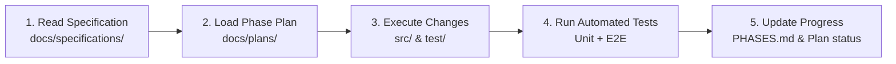

# AI Agent Guidelines & Engineering Protocol — LUXA Sales Backend

Welcome, AI Agent. This document defines the engineering standards, workflow lifecycle, and non-negotiable architectural guardrails for working within the `LUXA Sales Backend` repository.

---

## 1. Directory Structure for AI Planning & Specs

All technical specifications, guidelines, and execution plans reside in the `docs/` directory:

```
sales-backend/
└── docs/
    ├── AGENTS.md                              # This file (Agent rules & protocols)
    ├── TDD_WORKFLOW.md                        # TDD red-green-refactor guide & check suite
    ├── specifications/                        # Source of truth requirements
    │   └── SPEC-001-sales-backend-spec.md     # Master backend technical spec
    └── plans/                                 # Phased execution plans
        ├── PLAN-000-foundational-guardrails.md# Step 0: Shared infrastructure & guards
        ├── PLAN-001-development-guardrails.md # Dev guardrails, strictness & checks
        ├── PLAN-002-phase-2-profile-module.md # Phase 2: User profile & preferences
        ├── PLAN-003-phase-3-inventory-module.md# Phase 3: Inventory & bulk CSV imports
        ├── PLAN-004-phase-4-sales-module.md   # Phase 4: Sales transactions & refunds
        ├── PLAN-005-phase-5-analytics-module.md# Phase 5: Analytics & dashboard
        ├── PLAN-006-phase-6-notifications-module.md# Phase 6: Event-driven alerts
        └── PLAN-007-phase-7-team-module.md    # Phase 7: Team invitations & RBAC
```

---

## 2. Core Operational Workflow for AI Agents

Whenever assigned a task or phase in this repository, you **MUST** follow this 5-step sequence:



1. **Read the Specification**: Always inspect `docs/specifications/SPEC-001-sales-backend-spec.md` to understand entity schemas, route contracts, access permissions, and formulas.
2. **Review the Phase Plan**: Open the corresponding `docs/plans/PLAN-XXX-*.md` file. Confirm the files to modify/create and testing criteria.
3. **Execute Incrementally**: Write clean, modular NestJS code following project conventions (Controller $\rightarrow$ Service $\rightarrow$ DTOs $\rightarrow$ Module).
4. **Validate Thoroughly**:
   - Run the full gate: `npm run check` (lint, typecheck, architecture, test parity, unit tests, e2e, build)
   - Run unit tests: `npm run test`
   - Run integration tests: `npm run test:e2e`
   - Run build check: `npm run build`
5. **Mark Progress**: Update `PHASES.md` and the checklist inside the respective plan file.

---

## 3. Non-Negotiable Architectural Guardrails

### 3.1 Multi-Tenant Business Isolation
- **Rule**: Every database query touching business entities (`InventoryItem`, `Sale`, `SaleItem`, `HeldTransaction`, `Notification`, `TeamMember`) **MUST** filter by `where: { businessId: user.businessId }`.
- **User Context**: Extract the authenticated user via `@CurrentUser()` which provides `req.user.businessId`.
- **Zero Leakage**: Never write a query that omits `businessId` unless it is a public auth route (`/auth/register`, `/auth/login`, `/auth/refresh`).

### 3.2 Role-Based Access Control (RBAC) & Permissions
- **Hierarchy**:
  - `owner`: Full, unrestricted access to all endpoints. Bypasses all `@RequirePermissions()` checks.
  - `manager`: Broad administrative privileges as assigned.
  - `sales-assistant`, `checkout`, `inventory`, `apprentice`: Restricted to explicit permissions.
- **Enforcement**:
  - Use `@UseGuards(JwtAuthGuard, RolesGuard)` or `@UseGuards(JwtAuthGuard, PermissionsGuard)`.
  - Use decorators: `@Roles('owner', 'manager')`, `@RequirePermissions('record-sales', 'view-inventory')`.

### 3.3 Stock Concurrency & Atomic Database Transactions
- **Rule**: All sales checkout operations (`POST /sales`), stock decrements (`POST /inventory/:id/decrement`), and refunds (`PATCH /sales/:id/refund`) **MUST** run inside a TypeORM transaction (`dataSource.transaction()`).
- **Pessimistic/Atomic Locks**: Prevent overselling by validating stock availability atomically:
  ```typescript
  // Atomic decrement check:
  await transactionalEntityManager.createQueryBuilder()
    .update(InventoryItem)
    .set({ quantity: () => "quantity - :soldQty", sold: () => "sold + :soldQty" })
    .where("id = :id AND businessId = :businessId AND quantity >= :soldQty", { id, businessId, soldQty })
    .execute();
  ```

### 3.4 Decoupled Event-Driven Notifications
- **Rule**: Modules should not tightly depend on `NotificationsService` for alerts.
- **Pattern**: Use `@nestjs/event-emitter` (`EventEmitter2`):
  - When inventory drops to or below `reorderPoint` $\rightarrow$ `this.eventEmitter.emit('inventory.low-stock', payload)`.
  - When a sale completes $\rightarrow$ `this.eventEmitter.emit('sale.completed', payload)`.
  - `NotificationsListener` listens with `@OnEvent(...)` and inserts notifications asynchronously.

### 3.5 Consistent API Response & Error Contracts
- **Paginated Response**:
  ```json
  {
    "data": [...],
    "pagination": {
      "page": 1,
      "limit": 20,
      "total": 100,
      "pages": 5
    }
  }
  ```
- **Error Handling**: Use NestJS standard exceptions (`NotFoundException`, `BadRequestException`, `ForbiddenException`, `UnauthorizedException`, `ConflictException`).
- **Global Route Prefix**: All routes are prefixed with `/api` configured in `main.ts`.

---

## 4. Code Quality & Style Rules
1. **Strong Typing**: Use TypeScript strict types. Avoid `any` wherever possible.
2. **DTO Validation**: Every incoming request body and query parameter must be validated with **Zod** schemas applied through the reusable `ZodValidationPipe` (`@Body(new ZodValidationPipe(Schema))`). `class-validator` and `class-transformer` are **not** used.
3. **Repository Pattern**: Domain queries live in colocated repository classes (`src/auth/users.repository.ts`, `src/profile/user-profiles.repository.ts`) extending `Repository<Entity>`. Services inject these repositories — never TypeORM `Repository`/`@InjectRepository` directly. Controllers only delegate to Services.
4. **Layer Separation**: Enforced by `dependency-cruiser` (`.dependency-cruiser.cjs`) and ESLint `no-restricted-imports`. Controllers/services must not import `typeorm`/`@nestjs/typeorm`; repositories must not contain business logic.
5. **Test Parity**: Every `*.service.ts`, `*.controller.ts`, `*.repository.ts`, `*.guard.ts`, `*.strategy.ts`, and `*.pipe.ts` **MUST** have a colocated `*.spec.ts` (enforced by `scripts/require-tests.mjs` / `npm run check:tdd`).
6. **Documentation Preservation**: Preserve existing docstrings, entity configurations, and phase tracking structures.
